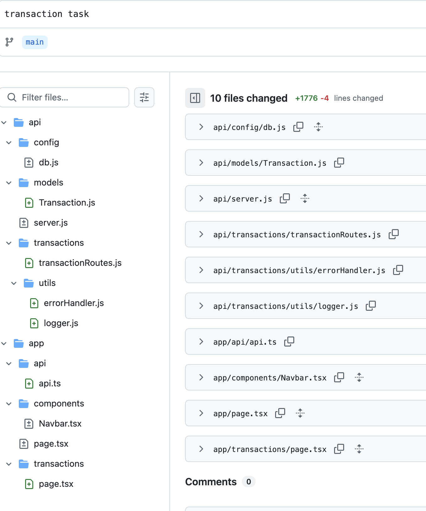

# 加密货币交易管理系统 (中文版)

## 项目完成概述

| TASK       | DESC                             | STATUS |
| ---------- | -------------------------------- | ------ |
| Backend    | Full Transaction Management API  | ✅      |
| Frontend   | Build a Simple Activity Table UI | ✅      |
| Designer   |                                  |        |
| Blockchain |                                  |        |
| Web3       |                                  |        |

### 全部代码列表



## 目录

- [功能特性](#功能特性)
- [实现细节](#实现细节)
- [前端](#前端)
- [后端](#后端)
- [核心代码实现](#核心代码实现)
- [安装部署指南](#安装部署指南)
- [注意事项](#注意事项)

## 功能特性

### 1. 交易管理

- **查看交易**: 可排序、分页的交易表格
- **添加交易**: 带有验证功能的模态表单，用于添加新交易
- **删除交易**: 带确认功能的交易删除操作
- **交易详情**: 全面展示交易信息

### 2. 高级筛选和排序

- **搜索功能**: 按用户名或代币筛选交易
- **类型筛选**: 按交易类型筛选（质押、借款、借出）
- **日期范围筛选**: 按日期范围筛选交易
- **排序功能**: 按金额、日期等字段排序

### 3. 状态跟踪

- **状态指示器**: 彩色状态标签（成功、等待中、已取消）
- **视觉区分**: 不同交易状态之间的清晰视觉区分

### 4. 增强的用户界面

- **响应式设计**: 适用于所有屏幕尺寸的完全响应式布局
- **工具提示**: 悬停功能，用于查看完整的交易描述
- **加载状态**: 数据加载和操作期间的视觉反馈
- **错误处理**: 优雅的错误处理，提供用户友好的消息


## 实现细节

### 前端

1. **API集成**
2. 实现Axios用于后端API交互
3. 处理响应数据并在用户界面中显示
4. 实现加载指示器和错误处理机制
5. 添加模拟数据作为API失败时的回退选项
6. **页面布局设计**
7. 设计带有分页支持的交易记录列表页
8. 提供搜索框和筛选条件（按类型、状态、日期范围）
9. 添加按钮以触发创建新交易记录或删除现有记录的操作
10. 实现响应式设计，确保在所有设备上的最佳体验
11. **表单验证**
12. 使用表单验证确保所有必填字段已填写且格式正确
13. 显示用户友好的错误消息
14. 添加实时验证反馈
15. **UI增强**
16. 实现带有颜色编码的状态标签（成功=绿色，等待=黄色，取消=红色）
17. 为描述字段添加工具提示以查看完整文本
18. 优化筛选部分的布局和样式
19. 改进表格设计，添加新列

### 后端

1. **模型定义**
2. 定义`Transaction`模型，包含`id`、`username`、`transactionType`、`token`、`amount`、`date`、`status`和`description`字段
3. 添加验证规则以确保数据完整性
4. **API路由实现**
5. 实现交易记录的CRUD操作
6. 添加基于`transactionType`、`startDate`、`endDate`、`status`和`description`的筛选功能
7. 支持分页、排序和搜索
8. 添加错误处理中间件
10. 配置CORS中间件以允许跨域请求
12. 添加请求日志记录

## 核心代码实现

### 交易接口定义

```typescript
export interface Transaction {
  id: string
  username: string
  transactionType: TransactionType
  token: string
  amount: string
  date: string
  status?: "canceled" | "successful" | "waiting"
  description?: string
}

export type TransactionType = "Stake" | "Borrow" | "Lend"
```

### Restful Api （CRUD）

```javascriptreact
const express = require('express');
const router = express.Router();
const { body, query , check, validationResult} = require('express-validator');
const Transaction = require('../models/Transaction'); // 引入模型

// @route    GET /api/transactions
// @desc     获取所有交易记录（支持分页、搜索、排序）
// @access   Public
router.get(
    '/',
    [
        // 查询参数验证
        check('page').optional().isInt({ min: 1 }).withMessage('页码必须是大于等于1的整数'),
        check('limit').optional().isInt({ gt: 0 }).withMessage('每页数量必须大于0'),
        check('search').optional().isString().withMessage('搜索关键词必须是字符串'),
        check('sortField')
            .optional()
            .isIn(['username', 'transactionType', 'token', 'amount', 'date'])
            .withMessage('排序字段不合法'),
        check('sortOrder').optional().isIn(['asc', 'desc']).withMessage('排序顺序必须为 asc 或 desc'),
        check('transactionType').optional().isIn(['Stake', 'Borrow', 'Lend']).withMessage('交易类型必须为 Stake/Borrow/Lend'),
        check('startDate').optional().isISO8601().toDate(),
        check('endDate').optional().isISO8601().toDate()
    ],
    async (req, res) => {
        const errors = validationResult(req);
        if (!errors.isEmpty()) {
            return res.status(400).json({ errors: errors.array() });
        }

        try {
            const page = parseInt(req.query.page) || 1;
            const limit = parseInt(req.query.limit) || 10;
            const search = req.query.search || '';
            const sortField = req.query.sortField || 'date';
            const sortOrder = req.query.sortOrder === 'desc' ? -1 : 1;

            const filter = {};

            // 添加 transactionType 条件
            if (req.query.transactionType) {
                filter.transactionType = req.query.transactionType;
            }

            // 添加搜索关键字匹配
            if (search) {
                filter.$or = [
                    { username: { $regex: search, $options: 'i' } },
                    { transactionType: { $regex: search, $options: 'i' } },
                    { token: { $regex: search, $options: 'i' } }
                ];
            }

            // 添加日期范围过滤
            filter.date = {};
            if (req.query.startDate) {
                filter.date.$gte = new Date(req.query.startDate);
            }
            if (req.query.endDate) {
                const endDate = new Date(req.query.endDate);
                endDate.setHours(23, 59, 59, 999); // 包含当天所有时间
                filter.date.$lte = endDate;
            }

            // 如果没有设置任何 date 条件，则删除 date 空对象
            if (!req.query.startDate && !req.query.endDate) {
                delete filter.date;
            }

            // 查询数据
            const transactions = await Transaction.find(filter)
                .sort({ [sortField]: sortOrder })
                .skip((page - 1) * limit)
                .limit(limit);

            const total = await Transaction.countDocuments(filter);

            res.json({
                data: transactions,
                total,
                currentPage: page,
                totalPages: Math.ceil(total / limit)
            });
        } catch (err) {
            console.error(err.message);
            res.status(500).send('Server Error');
        }
    }
);


// @route    GET /api/transactions/:id
// @desc     根据 ID 获取单个交易记录
// @access   Public
router.get('/:id', async (req, res) => {
    try {
        const transaction = await Transaction.findById(req.params.id);

        if (!transaction) {
            return res.status(404).json({ msg: '未找到该交易记录' });
        }

        res.json(transaction);
    } catch (err) {
        console.error(err.message);
        res.status(500).send('Server Error');
    }
});

// @route    POST /api/transactions
// @desc     创建新的交易记录
// @access   Public
router.post(
    '/',
    [
        check('username', '用户名为必填项').notEmpty(),
        check('transactionType', '交易类型必须为 Stake/Borrow/Lend').isIn(['Stake', 'Borrow', 'Lend']),
        check('token', '代币名称为必填项').notEmpty(),
        check('amount', '金额必须为数字').isNumeric()
    ],
    async (req, res) => {
        const errors = validationResult(req);
        if (!errors.isEmpty()) {
            return res.status(400).json({ errors: errors.array() });
        }

        try {
            const newTransaction = new Transaction(req.body);
            const saved = await newTransaction.save();
            res.status(201).json(saved);
        } catch (err) {
            console.error(err.message);
            res.status(500).send('Server Error');
        }
    }
);

// @route    PUT /api/transactions/:id
// @desc     更新某条交易记录
// @access   Public
router.put(
    '/:id',
    [
        check('username').optional().notEmpty().withMessage('用户名不能为空'),
        check('transactionType').optional().isIn(['Stake', 'Borrow', 'Lend']),
        check('token').optional().notEmpty().withMessage('代币名称不能为空'),
        check('amount').optional().isNumeric().withMessage('金额必须为数字'),
    ],
    async (req, res) => {
        const errors = validationResult(req);
        if (!errors.isEmpty()) {
            return res.status(400).json({ errors: errors.array() });
        }

        try {
            const updated = await Transaction.findByIdAndUpdate(
                req.params.id,
                req.body,
                { new: true, runValidators: true }
            );

            if (!updated) {
                return res.status(404).json({ msg: '未找到该交易记录' });
            }

            res.json(updated);
        } catch (err) {
            console.error(err.message);
            res.status(500).send('Server Error');
        }
    }
);

// @route    DELETE /api/transactions/:id
// @desc     删除某条交易记录
// @access   Public
router.delete('/:id', async (req, res) => {
    try {
        const deleted = await Transaction.findByIdAndDelete(req.params.id);

        if (!deleted) {
            return res.status(404).json({ msg: '未找到该交易记录' });
        }

        res.json({ msg: '交易记录已删除' });
    } catch (err) {
        console.error(err.message);
        res.status(500).send('Server Error');
    }
});

module.exports = router;
```


## 安装部署指南

### 环境准备

确保已安装以下软件：

- Node.js v14+
- MongoDB

### 后端安装

1. 克隆仓库：

```shellscript
git clone [repository-url]
cd backend
```

2. 安装依赖：

```shellscript
npm install
```

3. 配置API端点：

```shellscript
# 在.env文件中设置API基础URL
REACT_APP_API_BASE_URL=http://localhost:5001/api
```

4. 启动开发服务器：

```shellscript
npm run dev
```

5. 应用默认运行在`http://localhost:3000`

## 注意事项

- 确保后端服务正在运行，以便前端能够正确调用API
- 如需修改默认端口号，请相应调整前端代码中的API请求地址
- 系统默认使用模拟数据，可以通过取消注释API调用代码来切换到实际API
- 所有表单字段都有验证，确保输入正确的数据格式
